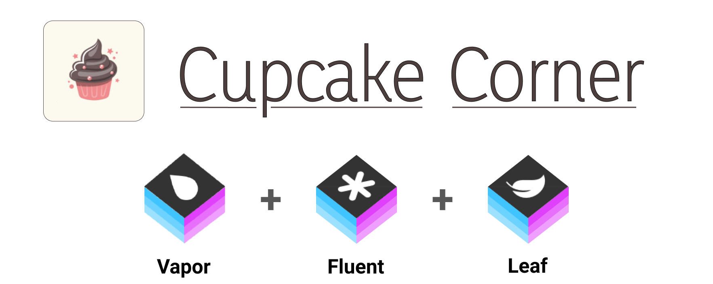
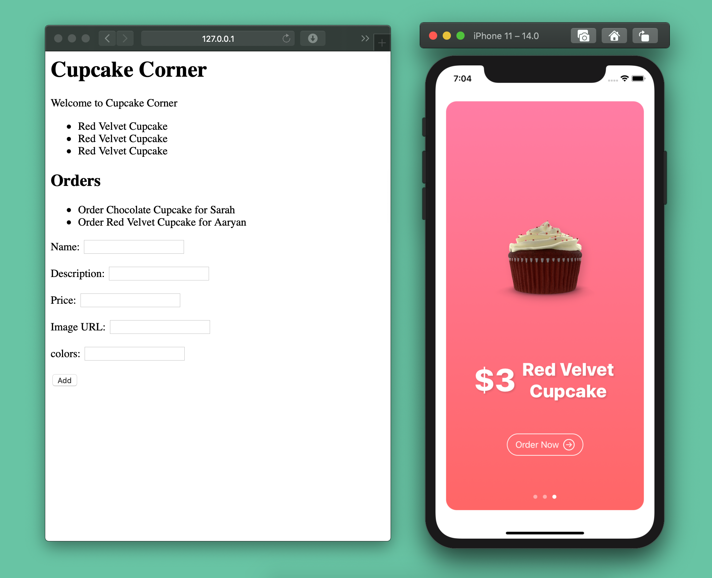

<b> A simple backend made using vapor. It allows to add cupcake types and view a list of cupcake orders. Its corrosponding iOS app is made using SwiftUI, which allows to order any cupcake. HTML rendering is done using <a href="https://github.com/vapor/leaf">Leaf</a> and the database used is SQLite implemented using <a href="https://github.com/vapor/fluent-sqlite-driver">Fluent</a>. 

 

<h1 align = "center">Screenshot</h1>

